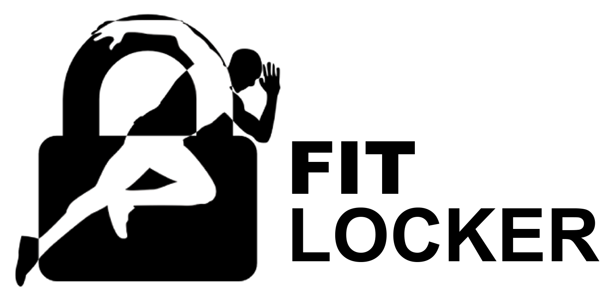

<p align="center">
  <h1 align="center">
    </img>
  </h1>
</p>

# :runner: FitLocker

> Lessen social media addiction or fix obesity? Why not both?

### Stop wasting time on social media by being fit and healthy!

FitLocker restricts your access to apps of your choice until you gain enough points which are awarded by doing physical activities. FitLocker should reduce compulsive and uncontrolled usage of addictive apps.

# Screenshots


<a href="https://www.youtube.com/watch?v=gHZGMeFVbCU">Youtube video</a>


# Installation

## Mobile Aplication

### For mobile app you need:
    - flutter
### Running application:
```
- cd app
```
```
- flutter packages get
```

    
```
- flutter run --release
```


***Remember to turn on USB Debugging on your mobile phone***

## :building_construction: Backend
### For backend you need:
    - docker
    - docker compose
### Running backend:

```
- docker compose up
```

# :clap: Contributing
If you want to help with the project, you can have a look at [some issues](https://github.com/SerekKiri/HackYeah2018/issues). All help is much appreciated :blush:
